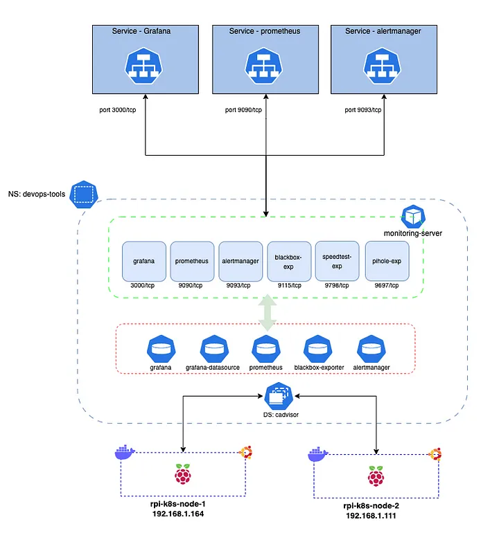
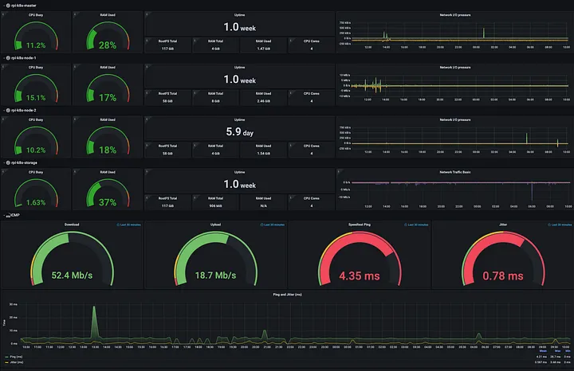

+++
title = "Deploy Prometheus, Grafana and alert manager on raspberry pi using Kubernetes"
date = "2023-03-03"
description = "Personal project showing how to deploy some resources on raspberry pi using K8s"
nofeed = true
math = true
notaxonomy = false
commentable = true
hidden = false
norobots = true
nodate = false
hidemeta = false
+++

Based on my personal project, I’d like to show how to deploy Grafana, Prometheus, Alertmanager, Blackbox, Speedtest, Cadvisor and Pi-hole exporter on Kubernetes.

This whole project will monitor my home internet, the Kubernetes nodes (raspberry pi) and the Pihole pod. Also, in terms of alarms, I’ve set up the Prometheus alert manager to send an email when the host is out of memory for example.

This is the dashboard that you’ll be able to see after the deployment.

You can find all details [here.](https://github.com/lessandro-ugulino/cluster-k8s-rpi/blob/main/roles/apps/monitoring/README.md)