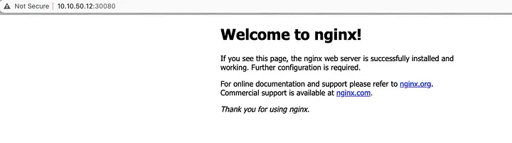

+++
title = "Disaster recovery in the Kubernetes cluster."
date = "2021-12-10"
description = "Real process of a DR in a Dev environment"
nofeed = true
math = true
notaxonomy = false
commentable = true
hidden = false
norobots = true
nodate = false
hidemeta = false
+++

In this article, I’ll show the process to backup the K8s etcd in one environment (A) and restore it in a different environment (B).

This diagram will help you visualize the process.


> The example in this post was tested in a Dev environment. Probably you’ll need to migrate more resources for a production one, but this can give you an idea of the process.

### Requirement
1. Make sure both environments are using the same version of `kubeadm`, `kubeclt` and `kubelet`

2. As you can see above, environments **A** and **B** are identical in terms of hostname and IP addresses.

**Backup K8s cluster environment A**
I’m assuming you already have a K8s cluster running workloads as below. Otherwise, you can follow this guide.

Link: [vagrant-k8s-ingress-nginx-automation](https://github.com/lessandro-ugulino/vagrant-k8s-ingress-nginx-automation?source=post_page-----31b5c24248e--------------------------------)


This is the command line to back up the K8s etcd.

``` bash
ETCDCTL_API=3 etcdctl snapshot save <backup-file-location> \
--endpoints=https://127.0.0.1:2379 \
--cacert=<trusted-ca-file> \
--cert=<cert-file> \
--key=<key-file>
```

You can find the required information running the below command.

```bash
kubectl get pods etcd-k8s-master -n kube-system \
-o=jsonpath='{.spec.containers[0].command}' | jq
```


The command for my environment.

```bash
ETCDCTL_API=3 etcdctl snapshot save /tmp/etcdBackup_envA.db \
--endpoints=https://10.10.50.10:2379 \
--cacert=/etc/kubernetes/pki/etcd/ca.crt \
--cert=/etc/kubernetes/pki/etcd/server.crt \
--key=/etc/kubernetes/pki/etcd/server.key
```

We can check the snapshot status.

```bash
ETCDCTL_API=3 \
etcdctl --write-out=table snapshot status /tmp/etcdBackup_envA.db
```


Now, you need to download the content, you can save it locally. We’ll need to upload this folder and file to environment **B**

* /etc/kubernetes/manifests

* /var/lib/etcd/member

* etcdBackup_envA.db

### Restore K8s cluster to environment B

As you can see below, there are no workloads running.


Execute the below command to restore the backup.

```bash
ETCDCTL_API=3 etcdctl snapshot restore /tmp/k8s-restore/etcdBackup_envA.db \
--endpoints=https://10.10.50.10:2379 \
--cacert=/etc/kubernetes/pki/etcd/ca.crt \
--cert=/etc/kubernetes/pki/etcd/server.crt \
--key=/etc/kubernetes/pki/etcd/server.key
```


Stop the services `kubelet` and `docker`.

```bash
systemctl stop docker
systemctl stop kubelet
```

Move the **etcd** data.

```bash
mv /var/lib/etcd/member /var/lib/etcd/member.bak
mv /tmp/k8s-restore/member /var/lib/etcd/
```

Move the manifests.

```bash
mv /tmp/k8s-restore/manifests/* /etc/kubernetes/manifests/
```

Start the service `kubelet` and `docker`.

```bash
systemctl start docker
systemctl start kubelet
```

After a couple of minutes, the pods will be created.


You can test your cluster scaling up some deployment, for example:

```bash
kubectl edit deployment.apps/nginx-deployment
```

Modify the replicas to 10. As you can see the pods were created.


Also, you can try to access it via NodePort.



Hopefully, it can help you.