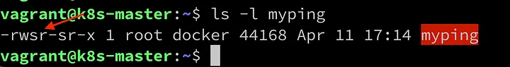

+++
title = "Security Containers: System Call and Permissions"
date = "2022-04-12"
description = "Post about system call and permissions on containers"
nofeed = true
math = true
notaxonomy = false
commentable = true
hidden = false
norobots = true
nodate = false
hidemeta = false
+++

### Related Articles

- [Let’s talk about Container Security](https://blog.ugulino.com/posts/28_feb_22/)

- [Security Containers: Control Groups](https://blog.ugulino.com/posts/10_oct_23/)

The majority of the time, you’ll see containers running a Linux operation system. Containers run Linux processes that are visible from the host.

A regular and a containerized process use system calls and need permission and privileges, but the difference is how these permissions are assigned at runtime or during the image build process for containers.

### System Calls

> Application run in what’s called user space.

The application will ask the kernel on its behalf if the application needs to do something like accessing a file or even find the time of the day. System Call or syscall interface is when the user space code uses to make these requests of the kernel.

Here are some examples of System calls:

**read**

read data from a file

**write**

write data to a file

**open**

open a file for subsequent reading or writing

**execve**

run an executable program

**chown**

change the owner of a file

**clone**

create a new process

Uncommonly application developers will need to worry about system calls. The lowest level that they can come across is the Glibc library or the Golang syscall package.

The system call is used the same way either if it’s running in a container or not. The challenge is due to containers are making a system call to the same kernel, they’re on a single host share.

Following the principle, least privilege, describe here we can allow users to limit the set of system calls that different programs can access.

### File Permissions

> There is a saying that in Linux, everything is a file.

Permissions on files determine which users are allowed to access those files and what actions they can perform on the files where it’s referred to as discretionary access control or DAC.

The below image describes the output command of ls -l. It shows information about the files and their attributes.

For the file permission group, there are three actions that users might be able to perform on this file: *read (r)*, *write (w)* or *execute (x)*.

In the above example the *owner*, *group*, and *any user* can execute the file.

Permissions on the *file* can be affected by the use of *setuid*, *setgid* and *sticky bits*. *Setuid* and *setgid* can be used by attackers to obtain additional permissions.

#### setuid and setgid

When you execute a file, the process that gets started inherits your user ID.

The below example shows a file owned by the user called lessandrougulino. Run this under root by executing `sudo sleep 100`

As you can see, the sleep process is running under the root UID.

Now, let’s try turning on the setuid bit.

`chmod +s sleep.sh`

Running the *sleep.sh* again, we can see the file (*sleep.sh*) has taken its user ID from the owner of the file

This bit is typically used to give a program privileges that it needs but that is not usually extended to regular users.

Let’s try with the command *ping*. As you can see, I can run the command as non-root.

Now, let’s take a copy of the *ping* command.

`cp /usr/bin/ping ./myping`

The permissions of *myping* command.

Let’s try to run it using *myping* command.

As you can see above, when you copy an executable, the file ownership attributes are set according to the user ID you’re operating as, and the *setuid* bit is not carried over.

The original ping executable has the **s** or **setuid** bit instead of a regular *x*.

Let’s set the *setuid* on the executable and try again.

`sudo chmod +s ./myping`

It’s working because *myping* executable has the *setuid* bit, which allows it to operate as root.

If you open a new terminal, you can see the *myping* executable isn’t running as **root**. It’s happening because the modern version of ping starts off running as **root**, but it explicitly sets just the capabilities that it needs and resets its user ID to be that of the original user, it jumps through some hoops.

>You can explore this in more detail, using [trace.](https://man7.org/linux/man-pages/man1/strace.1.html)

#### Security implications of setuid

It’s very easy to write your own program that does *setuid* on itself and then, having already transitioned to root, calls the shell.

Some container image scanners will report on the presence of files with the *setuid* bit set.

> *You can prevent it from being used with the* `--no-new-privileges` *flag on a docker run command*.

Version 2.2 of the Linux kernel introduced more granular control over these extra privileges through *capabilities*. I’ll cover it in the next post.