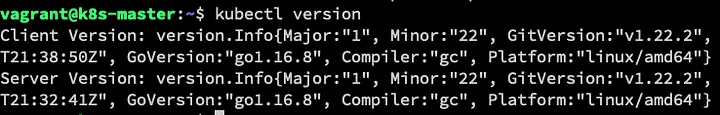
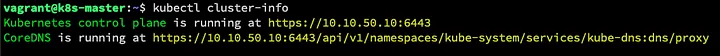
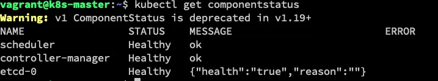
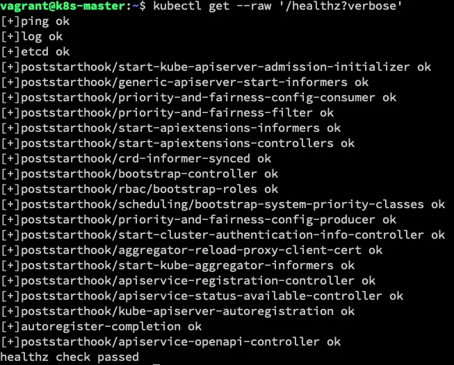
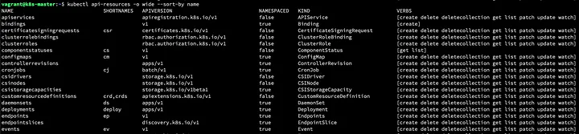
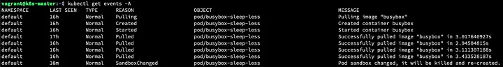
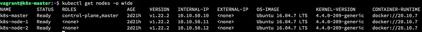
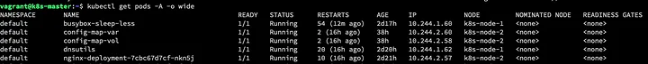
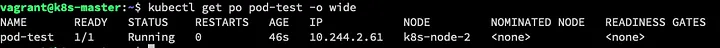
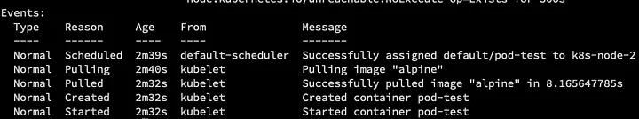

+++
title = "Debugging Kubernetes cluster pt.1"
date = "2021-10-19"
description = "Troubleshooting steps to help you understand a fix some K8s issues - part 1"
nofeed = true
math = true
notaxonomy = false
commentable = true
hidden = false
norobots = true
nodate = false
hidemeta = false
+++

I’m pretty sure you’ve debugged a lot of systems, and Kubernetes isn’t different. In this post, I’ll show some commands you can run to help you with this debugging.

This troubleshooting will focus on cluster operations. This will help you understand a cluster and make sure the core functionality, running pods, is available.

## Related Articles

[Debugging Kubernetes cluster — part2](https://medium.com/@lessandro.ugulino/debugging-kubernetes-cluster-pt-2-a160bf6b8cf2)

## Commands

1. `kubectl version`

This command will show us the current version running. It will help us when searching for errors and reading changelogs.

This command will show us the current version running. It will help us when searching for errors and reading changelogs.

2. `kubectl cluster-info`

This command will show where the cluster is running and if the CoreDNS is running.

As we can see from the command output, we’re running Kubernetes on a local (VirtualBox) machine and not on the cloud.

3. `kubectl get componentstatus`

This command will show if your scheduler, controller-manager and etcd are healthy.

As you can see the componentstatus command is deprecated in the CLI, but not yet removed.

Also, you can use the below command.

`kubectl get --raw '/healthz?verbose'`

This command won’t show scheduler or controller-manager output, but it shows a lot of additional information.

4. `kubectl api-resources -o wide -sort-by name`

This command will show what verbs are available, and it’ll help narrow down where you should look for errors. Maybe your workloads might be using an old alpha or beta API version, but the cluster may only use v1 or apps/v1.

5. `kubectl get events -A`

This command will show what was happening before and after things broke. With this output, you should focus on the type of output, reason and object.

6. `kubectl get nodes -o wide`

This command can bring a lot of information about the node(s) and master(s), such as **INTERNAL-IP**, **Operation System version**, **Age** and **Container-Runtime** version

This information will help in a potential problem and know where to look deeper at logs.

7. `kubectl get pods -A -o wide`

This command will show all pods running in all namespaces(-A parameter). Using the output, you can verify any error/failure.

8. `kubectl run pod-test --image=alpine -command -/bin/sleep 1d`

This command will create a pod named `pod-test`. This can show you if the pod’s creation is working as expected. Also, you can use the command `kubectl describe po pod-test` to look at the events of this pod.

`kubectl describe po pod-test`

Hopefully, these commands can help you during the Kubernetes troubleshooting process.