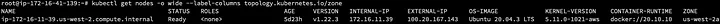
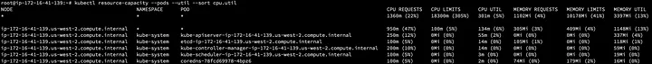
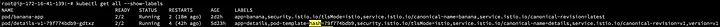
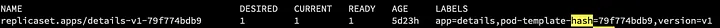
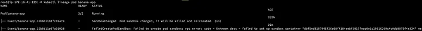
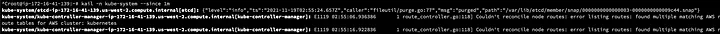
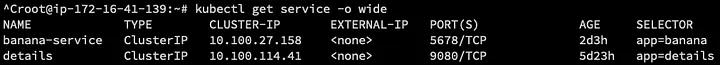
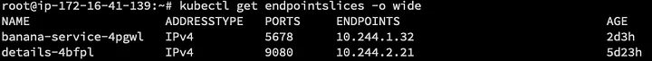
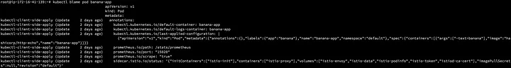

+++
title = "Debugging Kubernetes cluster pt.2"
date = "2021-11-20"
description = "Troubleshooting steps to help you understand and fix some K8s issues - part 2"
nofeed = true
math = true
notaxonomy = false
commentable = true
hidden = false
norobots = true
nodate = false
hidemeta = false
+++

### Related Articles

[Debugging Kubernetes cluster — part1](https://blog.ugulino.com/posts/19_oct_21/)

### Requirements

**a.** Install [Krew](https://krew.sigs.k8s.io/docs/user-guide/setup/install/?utm_source=thenewstack&utm_medium=website&utm_campaign=platform")

**b.** Install *resource-capacity* plugin

`kubectl krew install resource-capacity`

**c.** Install *lineage* plugin

`kubectl krew install lineage`

**d.** Install [kail](https://github.com/boz/kail).

**e.** Install *blame* plugin

`kubectl krew install blame`

### Troubleshooting commands

**a.** `kubectl get events — field-selector type=Warning — all-namespaces`

This command will show all warnings events in the cluster.

**b.** `kubectl get nodes -o wide — label-columns topology.kubernetes.io/zone`

This command will show any nodes that are not in a “ready” state, the version of kubelet or a different container runtime. Also, the parameter **zone** can show if any of your node problems are related to a specific zone.

**c.** `kubectl resource-capacity — pods — util — sort cpu.util`

Here we can see which pods are using more resources than they should be.

Obs.: This plugin requires that you have the [metrics-server](https://github.com/kubernetes-sigs/metrics-server?utm_source=thenewstack&utm_medium=website&utm_campaign=platform) installed.

**d.** `kubectl get all — show-labels`

This command will show the *pod-template-hash* which we can see if it matches between our deployment and pod.

**e.** `kubectl lineage pod ${POD}`

`kubectl lineage pod banana-app`

The plugin *lineage* can show what created a resource in Kubernetes and what depends on it.

**f.** `kail -n kube-system — since 1m`

This command will show all logs during the last minutes for the specific namespace, **kube-system**

**g.** `kubectl get service -o wide`

Here we can see the services in the cluster, which we can check the type of service it is, if there’s an external IP address or load balancer, and what labels are used.

**h.** `kubectl get endpointslices -o wide`

This will show us each of our services in the namespace and which pod IP addresses are associated with that service.

**i.** kubectl port-forward deploy $DEPLOYMENT $LOCAL_PORT:$POD_PORT

`kubectl port-forward deploy $DEPLOYMENT $LOCAL_PORT:$POD_PORT`

This command will let us bypass the load balancer or ingress controller to see if we can send traffic directly to one of the pods in the deployment.

**j.**  kubectl blame pod $PODblame**

`kubectl blame pod banana-app`

You can use it to see what parts of a pod manifest have changed and who or what changed them.

Hopefully, these commands can help you during the Kubernetes troubleshooting process.