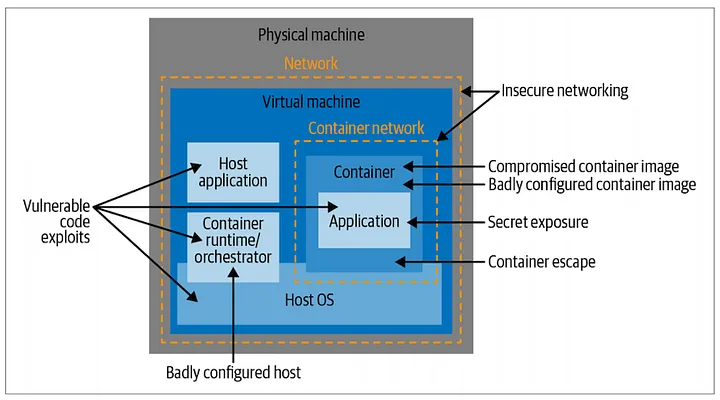

+++
title = "Let’s talk about Container Security"
date = "2022-02-28"
description = "This post will show the different kind of attacks and possible solutions."
nofeed = true
math = true
notaxonomy = false
commentable = true
hidden = false
norobots = true
nodate = false
hidemeta = false
+++

### Related Articles

- [Security Containers: System Call and Permissions](https://blog.ugulino.com/posts/12_apr_22/)

- [Security Containers: Control Groups](https://blog.ugulino.com/posts/10_oct_23/)

The term `container` started to popularize among the developer community in 2013, but it’s a fact that containers existed for several years before that.

Containers bring many advantages, for example, “*build once, run anywhere*”. The containerized application has everything it needs, and it’s easy to package up as a container image that will run the same on my laptop and your, or in a server/cloud.

On the security layer, there are attackers out in the world who want to steal data or modify the way a system behaves.

### Container threat model

*Threat modelling* is a process of identifying and enumerating the potential threats to a system.

There are a couple of actors involved in this threat modelling when we think about containers.

1. External attackers

2. Internal attackers, someone who has managed to access some part of the deployment.

3. Malicious internal actors, a developer and an administrator who have some level of privilege to access the deployment.

4. Inadvertent internal actors, who may accidentally cause problems.

5. Application processes, a process that might have programmatic access to the system.

The below image describes the different ways of a potential attack vector.

**Vulnerable application code.**

This process starts with the application code that a developer writes. This can be on the code itself or the third-party dependencies.

The best way to avoid this is to scan the images.

**Badly configured container images.**

After the code and image building, the next layer of possible vulnerability is how a container image is going to be built. It means the configuration can set up the container to run as the root user, giving it more privilege on the host than it really needs.

**Build machine attacks.**

This layer means if an attacker can modify or influence the way a container image is built, they could insert malicious code that will subsequently get run in the production environment.

**Supply chain attacks.**

The images are stored in a registry, but how do you know that image you pull is exactly the same as what you pushed earlier? An attacker can replace the image or modify it.

**Badly configured containers.**

This is when a YAML configuration file is misconfigured and it’ll run containers with settings that give it unnecessary, and perhaps unplanned privileges.

> Always double-check the settings when you download a YAML configuration files.

**Vulnerable hosts.**

The hosts that are running the containers can contain vulnerabilities such as an old version of orchestration components and unnecessary applications installed.

**Exposed secrets.**

Sometimes an application code needs credentials, tokens, or passwords to communicate with other components in a system.

This layer needs careful attention to not become a risk.

**Insecure networking.**

By default, the communication between containers is insecure, which means always is a good approach to setting up secure connections between components.

**Container escape vulnerabilities.**

The containers runtime, such as containerd and CRI-0 . Those runtimes are widely used, but it doesn’t mean there aren’t bugs to be found that would let malicious code running inside a container escape out onto the host.

### Security Boundaries

Security boundary defines what files a user can access. In the container world, the container itself is a security boundary and the application code should not be able to access code or data outside of the container except where it has explicitly been given permission to do so, a volume mounted for example.

Among the list describes above, there are other breaches where an attacker can access a container.

* A Vulnerability in an application dependency, execute code remotely within a container.

* The attacker can move out, either to another container or to the host where they can now access the host.

* Gain root privileges on the host. It can become a breach if the application code is running as root inside the container.

### Multitenancy

Multitenancy is the way that different users run their workloads on shared hardware, for example, AWS, Azure and Google Cloud where customers rent CPU time, memory, and storage, along with other features and managed services.

### Shared Machines
A shared machine means a single Linux machine (or virtual machine) may be shared by many users.

In enterprise situations, cloud-native environments, you are less likely to see this kind of shared machine.

### Virtualization
Virtualization doesn’t count as multitenancy at all, the users don’t have access to the hypervisor that manages their virtual machines, so they don’t share any software.

Sometimes, virtualization can bring the “noisy neighbour” issue where a user is sharing a physical machine with other users. You may need to consider the security boundaries between multiple groups of users.

### Container Multitenancy
The isolation between containers is not as strong as that between VMs.

In Kubernetes, you can use namespaces to subdivide a cluster of machines for use by different individuals, teams or applications.

*Role-based Access Control (RBAC)* is used to limit the people and components that can access these different Kubernetes namespaces.

### Security Principles

**Least Privilege**

You should limit access to the bare minimum that a person or component needs in order to do their job.

**Defence in Depth**

Apply layers of protection. If an attacker is able to breach one defence, another layer should prevent them from harming your deployment or exfiltrating your data.

**Reducing the Attack Surface**

* Reducing access points by keeping interfaces small and simple where possible.

* Limiting the users and components who can access a service.

* Minimizing the amount of code.

**Limiting the Blast Radius**

This means dividing an architecture into many instances of microservices.

**Segregation of Duties**

Different components or people are given authority over only the smallest subset of the overall system that they need.

In the next posts, I’ll bring more understanding about the security tools and best-practice processes to implement those security principles.